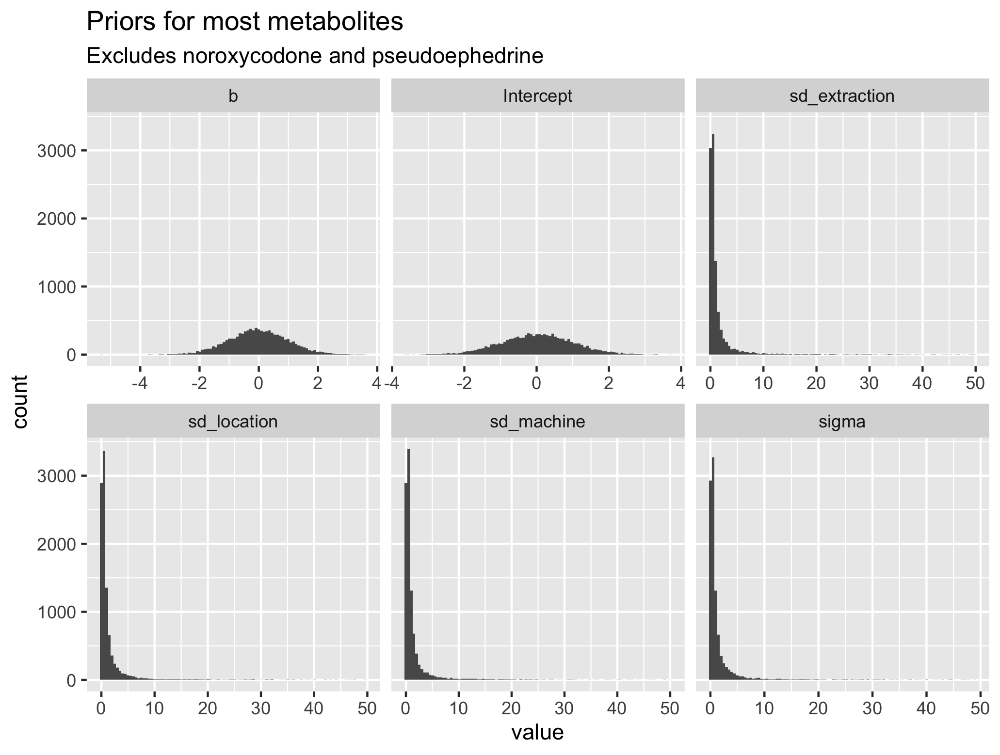
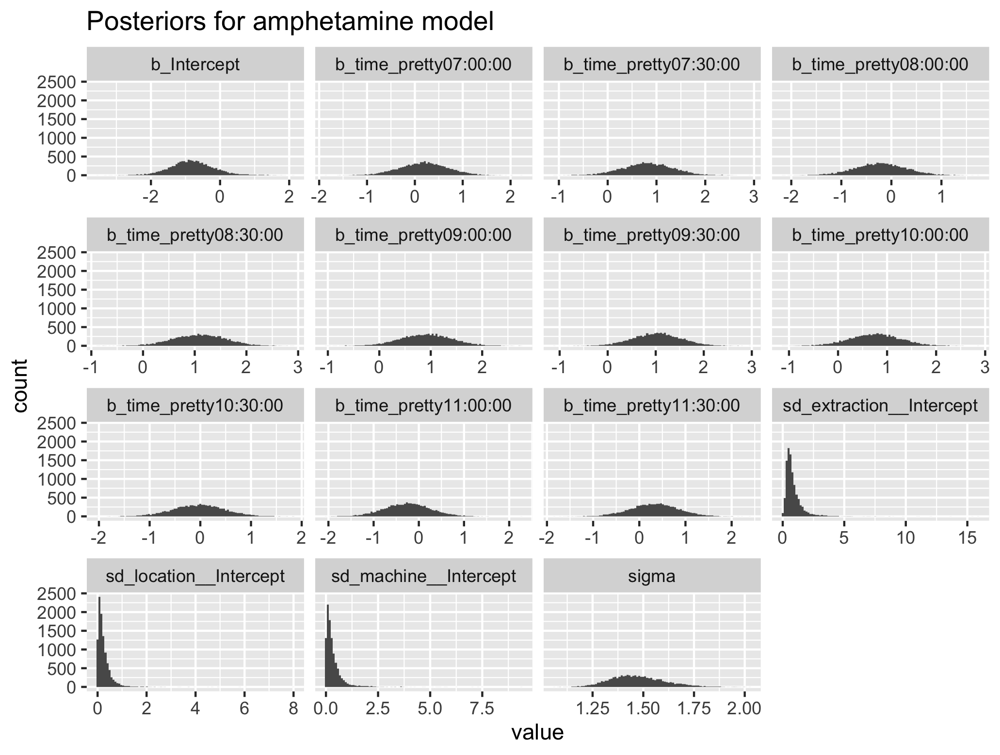

```{r setup, include=FALSE}
options(htmltools.dir.version = FALSE)
knitr::opts_chunk$set(
  fig.width=9, fig.height=3.5, fig.retina=3,
  out.width = "100%",
  cache = FALSE,
  echo = TRUE,
  message = FALSE, 
  warning = FALSE,
  hiline = TRUE
)
```

```{r xaringan-themer, include=FALSE, warning=FALSE}
library(xaringanthemer)
style_duo_accent(
  primary_color = "#1381B0",
  secondary_color = "#FF961C",
  inverse_header_color = "#FFFFFF",
  text_font_size = "1.75rem"
)
```

class: center, middle, inverse

## [mloop.github.io/wastewater-talk](https://mloop.github.io/wastewater-talk/)

---

background-image: url("https://chapelboromedia.s3.amazonaws.com/uploads/2021/02/11171326/Image-from-iOS-3.jpg")
background-size: cover


### .white[UNC beats Duke: Feb 12, 2021]

---

background-image: url("talk_files/mgs_ph.png")
background-size:contain

---

# Mass gatherings and substance use

- Could provide a window into community substance use
- A particular community could have a certain profile of substance use, leading to targeted interventions

---

# The problem

- How do we measure something that's (possibly) illegal to have?
- What if we don't have the resources our particular community needs?
- We should care for the health problems of our particular community (i.e., precision public health)

---

.pull-left[
## Matthew Loop

- PhD in Biostatistics / Postdoctoral Fellowship in Epidemiology from UAB
- Since 2020 have been an Assistant Professor in the Division of Pharmacotherapy and Experimental Therapeutics at the UNC Eshelman School of Pharmacy
]

.pull-right[

- "Statidemiologist" who estimates the effects of drugs using observational data
]

---

background-image: url("talk_files/team.png")
background-size: cover

---

class: center, middle, inverse

## So, where might you go to look for substances abused at a mass gathering?

---

background-image: url("https://www.stadiumjourney.com/wp-content/uploads/2015/09/Welcome-to-the-Swamp.jpg")
background-size: cover

---

# Measure the drug concentrations

- Used a Teledyne ISCO sampler
- Sampling 1 hour before game to 30 minutes after game
- Samples of 300 mL wastewater collected every 30 minutes


---

# Measure the drug concentrations

**pics**

---

# Measure the drug concentrations
- Wastewater samples underwent solid phase extraction
- Samples were run on two different machines
    - Waters Acuity TQD LC-MS/MS (designed for wastewater; broad range)
    - Shimadzu 8040 LC-MS/MS (designed for urine samples; smaller range)

---

background-image: url("talk_files/missing_data.png")
background-size: contain

---

background-image: url("talk_files/histogram.png")
background-size: contain

---

# Model the concentration values

- Continuous, bounded outcome with heavy right skew
- Values not observed because they are below or above limits of quantitation
- Clustering of values (samples taken from same location)
- Small sample sizes (only one observation per group)

---
# Model the concentration values

- Multilevel modeling to account for the correlation
- Use the log transformed values to make the normal likelihood more scientifically plausible
- Modeled the 10 compounds that were detected in at least 50% of the samples

---
# (What is a multilevel model?)

- Basically a linear regression model with variables to represent group, but the variables are *special*
- Our groups were: location of measurement (3 levels), lab member who performed the solid-phase extraction (2 levels), and machine we ran the LC-MS on (2 levels)
- Multilevel models "borrow" information from one level to predict the mean of another level

---
# Model the concentration values

- Modeled the values above and below the limits of quantitation as "censored" (just like in survival analysis)
- Slightly informative priors helped get the model to fit with the small sample sizes

---
class: middle
.pull-left[

]

.pull-right[

]
---
background-image: url("talk_files/02_marginal_means.png")
background-size: contain

---
background-image: url("talk_files/ppcs_amphetamine.png")
background-size: contain

---

# Estimate consumption

1. Estimate the flow of water during last 30 minutes
2. Estimate "mass load" (mg of compound) based on concentration and flow over last 30 minutes
    - calculation involves a lot of assumptions about proportion of stadium water flow through that location and the stability of the compounds
3. Estimate the number of doses consumed over entire sampling period
    - more assumptions about excretion rate, ratio of molecular weights of parent compound to metabolite (e.g., cocaine to benzoylecgonine), and typical dose

---
background-image: url("talk_files/mass_load_time.png")
background-size: contain

---

background-image: url("talk_files/02_posterior_predictive_doses.png")
background-size: contain

---
# Summary of findings

1. We could detect compounds that are commonly abused using wastewater outflow at a college football game
2. Median concentrations were highest at times when more people are going to the bathroom (e.g., in between quarters or half-time)
3. Narcotics and opioids were among the most common compounds detected

---
# Limitations

- Study sampling process of "using the bathroom in the stadium during a game" is imperfect representation of substance use in Gainesville community
- A ton of assumptions from estimated concentration to number of doses throughout the game
- Cannot distinguish between recreational use and indicated use
- Cannot distinguish between before stadium entry use and during game use

---
# Future directions

- Submitted an R21 to sample at multiple games: game-to-game variability, environmental predictors of concentrations, and broader impact of game day on health services delivery
- Improve understanding of very specific exposures in a very specific population -> precision public health
- Further combine basic science and population health strategies to understand substance use / abuse in our communities (who deserve our best)
- Could get a picture of use in a community that is more accurate than self-report 

---
class: inverse, middle, center

# Questions
